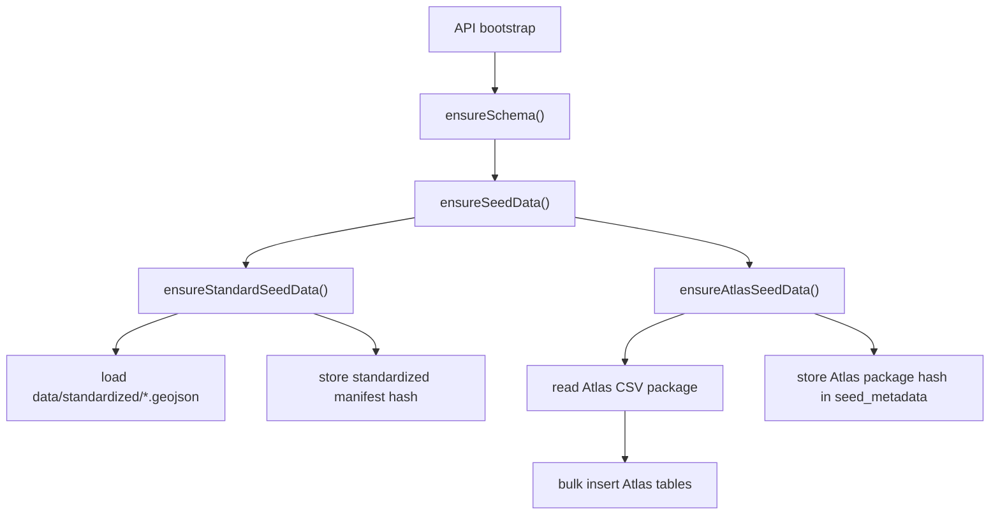
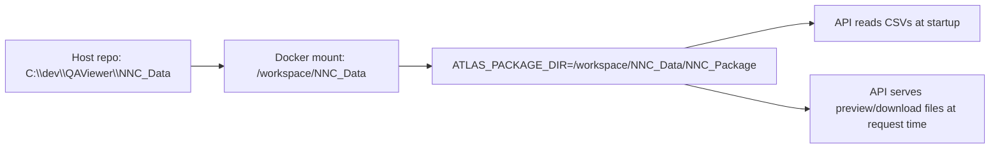
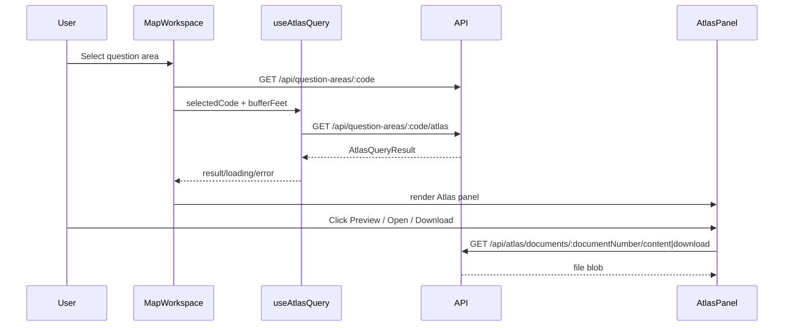

# Atlas Workspace System Report

## Purpose

This report describes how the Atlas workspace works in QAViewer after the `codex/atlas-workspace-v1` implementation.

The important design choice is that Atlas is **additive**, not a replacement for the app's current standardized-review model:

- standardized `question_areas`, `land_records`, and `management_areas` still drive the main review app
- Atlas data is imported into its own tables
- Atlas results are resolved only when a reviewer selects a question area and opens the right-side Atlas workspace
- Atlas files stay on disk in `NNC_Data/NNC_Package`; they are not copied into `backend/uploads`

## Scope

What this system does:

- imports Atlas package CSVs into Atlas-specific Postgres/PostGIS tables
- keeps Atlas package files on disk and serves them directly for preview/download
- spatially matches Atlas land records to the selected question area using a fixed buffer
- shows matched Atlas records, linked documents, warnings, and preview/download actions in the right rail
- draws Atlas buffer and matched Atlas geometries on the map

What this system does not do:

- reconcile Atlas records with the app's standardized `land_records` overlay
- clean or normalize Atlas source data
- merge Atlas documents into the QA upload workflow
- surface featureless Atlas docs in the main matched-record workflow

## System At A Glance

```mermaid
flowchart LR
    A["Reviewer selects question area"] --> B["Frontend MapWorkspace"]
    B --> C["useAtlasQuery(bufferFeet, selectedCode)"]
    C --> D["GET /api/question-areas/:code/atlas"]
    D --> E["PostGIS spatial buffer around selected question_areas.geom"]
    E --> F["atlas_land_records intersecting buffer"]
    F --> G["atlas_document_links"]
    G --> H["atlas_documents"]
    H --> I["atlas_document_manifest"]
    I --> J["AtlasQueryResult JSON"]
    J --> K["AtlasPanel"]
    J --> L["AtlasMapOverlays"]
    K --> M["GET /api/atlas/documents/:documentNumber/content"]
    K --> N["GET /api/atlas/documents/:documentNumber/download"]
    M --> O["File under NNC_Data/NNC_Package"]
    N --> O
```



## Runtime Layers

### 1. Standardized review layer

This remains the main application model:

- `question_areas`: selection anchor for the reviewer workflow
- `land_records`: existing seeded overlay layer on the map
- `management_areas`: existing seeded overlay layer on the map
- `comments` and `documents`: existing QA review collaboration and upload tables

### 2. Atlas support layer

This is the new Atlas-specific support model:

- `atlas_land_records`
- `atlas_documents`
- `atlas_document_links`
- `atlas_featureless_docs`
- `atlas_document_manifest`

These tables are isolated from the standardized seed model and only power the Atlas panel and Atlas file lookup.

## Atlas Data Model

### Entity Relationship Diagram

```mermaid
erDiagram
    QUESTION_AREAS {
        int id PK
        text code UK
        geometry point_geom
    }

    ATLAS_LAND_RECORDS {
        text lr_number PK
        text tract_key
        text primary_document_number
        text property_name
        text fund_name
        text region_name
        geometry geom_nullable
    }

    ATLAS_DOCUMENT_LINKS {
        int id PK
        text lr_number FK
        text document_number FK
        text page_no
    }

    ATLAS_DOCUMENTS {
        text document_number PK
        text doc_name
        text doc_type
        text recording_instrument
    }

    ATLAS_FEATURELESS_DOCS {
        text document_number PK_FK
    }

    ATLAS_DOCUMENT_MANIFEST {
        int id PK
        text document_number
        text package_relative_path
        text file_name
        text extension
        bigint size_bytes
    }

    QUESTION_AREAS ||..o{ ATLAS_LAND_RECORDS : "matched by spatial buffer only"
    ATLAS_LAND_RECORDS ||--o{ ATLAS_DOCUMENT_LINKS : "lr_number"
    ATLAS_DOCUMENTS ||--o{ ATLAS_DOCUMENT_LINKS : "document_number"
    ATLAS_DOCUMENTS ||--o| ATLAS_FEATURELESS_DOCS : "optional featureless marker"
    ATLAS_DOCUMENTS ||..o{ ATLAS_DOCUMENT_MANIFEST : "resolved by document_number when present"
```

### Atlas Table Inventory

| Table | Source file | Primary key / identity | Purpose | Important notes |
|---|---|---|---|---|
| `atlas_land_records` | `land_records.csv` | `lr_number` | Spatial Atlas parcel/record layer | `geom` is nullable because the package includes records without geometry |
| `atlas_documents` | `documents.csv` | `document_number` | Atlas legal document metadata | Separate from QA upload `documents` |
| `atlas_document_links` | `document_links.csv` | `id` | Junction table between land records and documents | Many-to-many relationship |
| `atlas_featureless_docs` | `featureless_docs.csv` | `document_number` | Documents intentionally not tied to a parcel geometry | Loaded, but not surfaced in the main v1 workflow |
| `atlas_document_manifest` | `document_manifest.csv` | `id` | File inventory and package-relative paths | Used to resolve on-disk files under `NNC_Data/NNC_Package` |

## Package Inputs

From `NNC_Data/NNC_Package/HANDOFF.md`:

| File | Rows | Runtime use |
|---|---:|---|
| `land_records.csv` | 1,693 | imported into `atlas_land_records` |
| `documents.csv` | 497 | imported into `atlas_documents` |
| `document_links.csv` | 2,740 | imported into `atlas_document_links` |
| `featureless_docs.csv` | 24 | imported into `atlas_featureless_docs` |
| `document_manifest.csv` | 1,537 | imported into `atlas_document_manifest` |
| `question_areas.csv` | 227 | not used for matching in v1; the app uses existing `question_areas` instead |
| `rejected_document_links.csv` | 566 | not imported; evidence of source linkage issues |
| `rejected_duplicate_land_records.csv` | 5 | not imported; evidence of source duplication issues |
| `rejected_duplicate_documents.csv` | 1 | not imported; evidence of source duplication issues |

## Bootstrap And Import

### Startup flow



### Import behavior

The Atlas import is intentionally simple:

- CSV rows are parsed in the API process
- rows are inserted in batches
- geometry is hydrated from `geom_wkt` into PostGIS
- package-relative file paths are stored as metadata only
- file contents remain outside the database on disk

### Idempotency and drift protection

The system stores an Atlas package hash in `seed_metadata`:

- if Atlas tables are already populated and the package hash matches, startup continues
- if Atlas tables are partially populated, startup fails fast
- if Atlas package contents changed after import, startup fails fast

This mirrors the existing standardized-seed protection model.

## Docker Runtime Dependency

Atlas is not just a database import. It also has a runtime filesystem dependency.



For Docker-based development, the API service must have:

- `ATLAS_PACKAGE_DIR=/workspace/NNC_Data/NNC_Package`
- a read-only mount from `./NNC_Data` to `/workspace/NNC_Data`

Without that, the API can build but will fail at runtime because the package is not visible inside the container.

## Query Path

### Atlas query endpoint

`GET /api/question-areas/:code/atlas?buffer=<100|500|1000|5000>&unit=feet`

### Query algorithm

1. Load the selected row from existing `question_areas`.
2. Build a geography buffer around `question_areas.geom`.
3. Spatially match only `atlas_land_records` rows where `geom IS NOT NULL`.
4. Join to `atlas_document_links`.
5. Join to `atlas_documents`.
6. Join to `atlas_document_manifest` by `document_number`.
7. For each linked document:
   - resolve its `package_relative_path`
   - enforce path safety so the resolved path stays under the Atlas package root
   - check whether the file exists
   - determine whether inline preview is supported
8. Return:
   - selected question area code
   - active buffer value and unit
   - buffer geometry
   - matched records
   - linked documents per record
   - warnings

### Why this is intentionally separate from the seeded overlay

The map still shows the app's standardized `land_records` layer as the main overlay.

Atlas data is used only for:

- right-side contextual review panel
- orange Atlas buffer overlay
- orange highlighted Atlas matches

That separation is deliberate so Atlas can be evaluated without changing the current standardized runtime model.

## File Serving Model

### Endpoints

| Endpoint | Purpose | Behavior |
|---|---|---|
| `GET /api/atlas/documents/:documentNumber/content` | inline preview | returns `404` if missing, `415` if not previewable |
| `GET /api/atlas/documents/:documentNumber/download` | file download | returns `404` if manifest/file resolution fails |

### Resolution rules

- file lookup is driven by `atlas_document_manifest.package_relative_path`
- path traversal is blocked by resolving the candidate path and verifying it remains under the Atlas package root
- preview is limited to supported formats such as PDF and common raster images

## Frontend State Model

### Main Atlas state additions

| State | Location | Purpose |
|---|---|---|
| `selectedCode` | `MapWorkspace` | current question area selection |
| `atlasBufferFeet` | `MapWorkspace` | active fixed buffer preset |
| `atlasState.result` | `useAtlasQuery()` | current Atlas query payload |
| `atlasState.loading` | `useAtlasQuery()` | Atlas-only loading state |
| `atlasState.error` | `useAtlasQuery()` | Atlas-only error state |
| `previewDocument` | `AtlasPanel` | current preview target |
| `previewState` | `AtlasPanel` | local object URL + preview type |

### Frontend flow



### UI behavior

When no question area is selected:

- the right rail shows an empty Atlas state

When a question area is selected:

- Atlas query loads independently of the left-side detail workflow
- the panel shows counts, warnings, matched records, linked documents, and preview actions
- map overlays update from the Atlas API response

This means Atlas can fail or return zero matches without breaking the main review workflow.

## Current Data-Quality Pressure Points

These are the main issues the new system now makes visible.

### 1. Null geometry Atlas records

The Atlas package includes land records without geometry. These rows are imported, but excluded from spatial matching.

Impact:

- records may exist in Atlas but never appear in the matched-record list
- users only see them indirectly through warnings, not through parcel matches

### 2. Featureless documents are loaded but not surfaced

`atlas_featureless_docs` is preserved in the database, but the v1 reviewer flow does not surface those documents in the main Atlas panel.

Impact:

- some valid Atlas documents may exist but appear "missing" from the reviewer's mental model because they are not parcel-linked

### 3. Manifest-to-document coverage is incomplete by design

`atlas_document_manifest` is a file inventory. Not every row has a document number, and file availability is resolved through `document_number` when present.

Impact:

- files can exist physically in the package without resolving into the linked-document workflow
- a document link may exist in the relational model while file lookup still fails

### 4. Rejected source artifacts indicate upstream quality issues

The package includes:

- `rejected_document_links.csv`
- `rejected_duplicate_land_records.csv`
- `rejected_duplicate_documents.csv`

These are not imported into runtime tables, but they are strong evidence that the Atlas export already contains known linkage and duplication issues upstream.

### 5. Spatial-only matching is intentionally narrow

V1 does not reconcile on:

- property name
- tract key
- owner
- document number

It matches only on buffer intersection with the selected question area point.

Impact:

- false positives are possible in dense areas
- false negatives are possible for relevant but non-intersecting or featureless Atlas records

### 6. Atlas package availability is a runtime dependency

The app now depends on:

- valid mounted package path
- intact `package_relative_path` values
- files actually present under the package root

Impact:

- the database can be correct while preview/download still fails because the filesystem package is incomplete or mounted incorrectly

## Operational Notes

### What to reset when data changes

If Atlas package CSVs change:

- Atlas hash protection will fail startup against an already-populated database
- local development should reset the database and reseed

If standardized seed files change:

- the existing standardized manifest protection still applies independently

### Smoke verification that now matters

The meaningful end-to-end checks for this system are:

1. API boot with Atlas package visible inside Docker
2. Atlas tables imported successfully
3. `GET /api/question-areas/:code/atlas` returns buffer geometry and records
4. `GET /api/atlas/documents/:documentNumber/content` works for previewable files
5. `GET /api/atlas/documents/:documentNumber/download` works for linked files
6. right rail updates when buffer changes
7. left rail review workflow remains unaffected

## Suggested Next Phase

If the goal is to attack data issues next, the most useful next-phase work would be:

1. build a data-quality report page or export based on:
   - missing geometry
   - missing file
   - featureless docs
   - rejected links
   - duplicate candidates
2. expose featureless documents in the Atlas panel
3. add a provenance/debug view showing:
   - Atlas source file
   - manifest match status
   - package-relative path
   - previewability status
4. add reconciliation tooling between:
   - standardized `land_records`
   - `atlas_land_records`
5. decide whether future Atlas matching should combine:
   - spatial match
   - property/tract heuristics
   - document-based heuristics

## Code Pointers

Key implementation files:

- `backend/src/lib/schema.ts`
- `backend/src/lib/seed.ts`
- `backend/src/lib/atlas.ts`
- `backend/src/routes/questionAreas.ts`
- `backend/src/routes/atlas.ts`
- `frontend/src/components/MapWorkspace.tsx`
- `frontend/src/components/AtlasPanel.tsx`
- `frontend/src/components/AtlasMapOverlays.tsx`
- `frontend/src/lib/atlas.ts`
- `docker-compose.yml`
